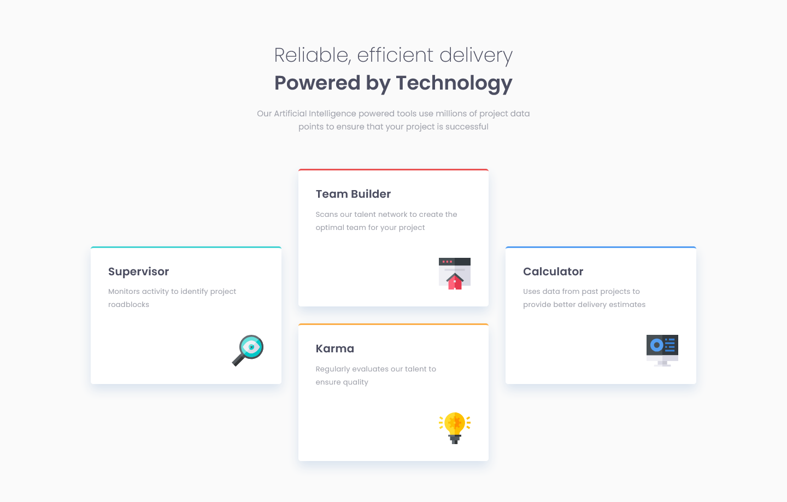

# Frontend Mentor - Four card feature section solution

This is a solution to the [Four card feature section challenge on Frontend Mentor](https://www.frontendmentor.io/challenges/four-card-feature-section-weK1eFYK).

### Screenshot

### Links

- Solution URL: [Solution URL here](https://www.frontendmentor.io/solutions/four-card-feature-section-IWSK-vEwZv)
- Live Site URL: [Live site URL here](https://donjr2.github.io/Frontend-Mentor---Four-card-feature-section-solution/)

### Built with

- Semantic HTML5 markup
- CSS custom properties
- CSS Grid

## Author

- Frontend Mentor - [@Tuhin-jr](https://www.frontendmentor.io/profile/Tuhin-jr)
